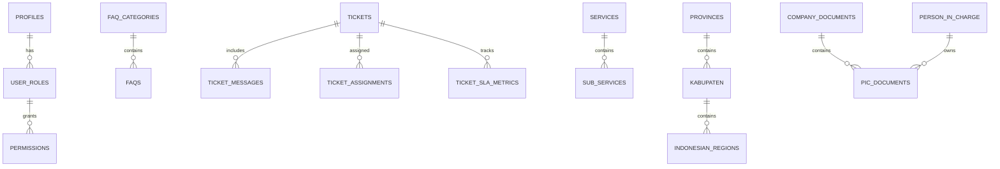

# Entity-Relationship Diagram (ERD)

This document describes the main entities and relationships in the application's PostgreSQL database, as managed by Supabase migrations.

## Main Entities

- **profiles**: Stores user profile information.
- **user_roles**: Maps users to roles.
- **faq_categories**: FAQ category definitions.
- **faqs**: Frequently asked questions.
- **tickets**: Support tickets.
- **telekom_data**: Telecommunication data records.
- **ticket_messages**: Messages within a ticket.
- **ticket_assignments**: Assignment history for tickets.
- **ticket_sla_metrics**: SLA tracking for tickets.
- **services**: Main service categories.
- **sub_services**: Detailed service types.
- **provinces**: Indonesian provinces.
- **kabupaten**: Cities/regencies.
- **indonesian_regions**: Hierarchical region data (province, kabupaten, kecamatan, kelurahan).
- **audit_logs**: Security and audit logs.
- **api_integration_logs**: Logs for API integrations.
- **modules**: System modules for permissions.
- **fields**: Fields within modules.
- **permissions**: Role-based permissions.
- **record_permissions**: Record-level permissions.
- **permission_templates**: Templates for quick role setup.
- **company_documents**: Company document records.
- **person_in_charge**: Person in charge (PIC) records.
- **pic_documents**: Documents related to PICs.

## Relationships

- Users have roles (`profiles` ↔ `user_roles`).
- Tickets are linked to users, messages, assignments, and SLA metrics.
- Services have sub-services.
- Regions are hierarchical: provinces → kabupaten → indonesian_regions.
- Permissions are role-based and field-level.
- Documents are linked to companies and persons in charge.

## ERD Diagram (Mermaid)

> **How to view as a diagram:**  
> - Copy the code block below and paste it into a [Mermaid Live Editor](https://mermaid.live/) or use a VS Code extension like "Markdown Preview Mermaid Support" to render it as a diagram.
> - You can export the diagram as PNG/SVG from the Mermaid Live Editor.

> **Note:** For full details on each table's columns and constraints, see the Supabase migration SQL files.

---
**To export as an image:**  
1. Copy the Mermaid code block above.
2. Go to [https://mermaid.live/](https://mermaid.live/).
3. Paste the code and view the diagram.
4. Use the "Download" button to export as PNG or SVG.
